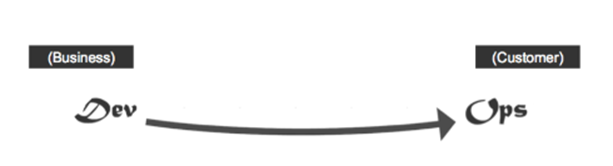
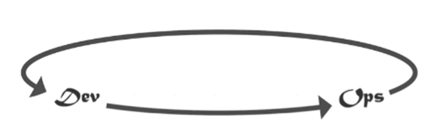
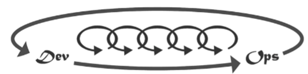

## Summary
The book introduces Bill, who is thrown into the position of VP of IT in a manufacturing company. The IT department is in chaos and managing it is nearly impossible. Staff is buried in work, but somehow not much work gets done. At least according to everyone else, apart from IT itself. 
Throughout the book, we see the transformation of IT into a well-oiled machine with measurable achievements and the relationship development between IT and the business. The change is facilitated by Bill’s willingness to save the company and the department, and his ability to listen and learn. Most of his learnings are instigated by a prospective and eccentric board member Erik.
Erik teaches Bill the Three Ways and help him define what work even is. Turns out that while being extremely busy, Bill and his team can’t even correctly identify what constitutes as work. This makes it difficult to optimise work, if you can’t describe what it is.

# What is work?
Bill identified IT work as:
| Type of work | DevOps | DataOps (?) |
| ----------- | ----------- | ----------- | 
| Business projects      | Business initiatives, most of the development work       | Business initiatives relating to data analytics and reporting. E.g. creating reports, PBI dashboard, conducting analysis to answer conversion/sales questions. For data engineering: database build out, data load and processing, if data infrastructure can’t support the business project |
| Internal IT projects   | Infrastructure and IT operations. Creating new environments, automating things.        |*Analytics*: Seld-development, creating internal processes (like the PBI guide), creating PBI training, 1-2-1 internal sessions to improve skills and check-in (like PBI-related meetings with Kelvin to go through the latest updates, or new things we learned). *Engineering*: Improving the database, writing stored procedures, automating processes (e.g.  migrations), SQL teaching sessions for the devs | 
| Updates and changes | Updates and changes to different systems, often generated by the two above types of work | *Analytics*: Changes and updates to existing reports, improvements as a result of studying and learning, updates due to poor performance (e.g. refresh time is slow), additional analysis based on existing reports/analysis work, maintenance of security. *Engineering*: Changes and updates to existing database scripts, performance improvements, new features/maintenance work. |
| Unplanned work or recovery work | “anti-work”, incidents and problems generated by other work. | *Analytics*: Report breaking due to data changes/Microsoft updates, credentials expiring. Human error: report deletion by accident, work lost, error in analysis which needs to be redone. *Engineering*: Database crash, overnight loads not running | 

# The Three Ways
## Way 1: Flow/Systems Thinking 

-	Emphasis on the performance of the entire system, rather than a specific silo of work or department
-	Understand the flow of work. Understand what work is, where it comes from, and that it can only go forward
    - Know what exactly can help achieve business objectives – projects, security, compliance with regulations etc. It is the outcomes that really matter, not the work you do.
-	Increase work flow – identify bottlenecks and constraints, decrease WIP
-	Create quality at each step, from the source onwards
-	Never allow local optimization to create global degradation – local vs global objectives
-	Achieve profound understanding of the system – understand business goals, how value is delivered, people, processes and technology needed to deliver it, risks and solutions to these risks.
-	Automation

## Way 2: Feedback Loops

- Create and facilitate fast feedback from the customers
- Limit the amount of re-work and fix quality
- Understand and monitor internal and external processes and customers
- Create a better cooperation between Development and IT Operations – “shared goals and shared pain”
- Create the quality at the source by placing the feedback loops as early as possible
- Make work wait times visible. This will ensure that you're aware of your processes and when they'll be complete, and when new ones can be picked up
- 
- 

## Way 3: Continual Experimentation and Learning

- Take risks and learn from failure
- Continuously experiment to improve the process, daily work
- Test the system for resilience and security holes
- Allocating at least 20 percent of Development and IT operations cycles toward non-functional requirements
- Build and maintain trust
